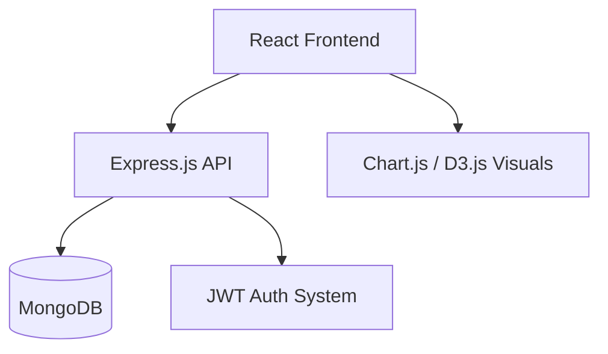

# 💰 Finance Tracker

> A modern full-stack personal finance tracking app that helps users monitor expenses, categorize spending, and visualize financial trends over time. Built with the **MERN stack** and designed with responsive UI for desktop and mobile users.

---

## 📚 Contents

- [✨ Features](#-features)
- [🏗️ Architecture](#️-architecture)
- [⚡ Quick Start](#-quick-start)
- [🌐 Tech Stack](#-tech-stack)
- [📂 Project Structure](#-project-structure)
- [🔐 Environment Variables](#-environment-variables)
- [🧪 Testing & Linting](#-testing--linting)
- [📊 Sample Dashboard](#-sample-dashboard)

---

## ✨ Features

| Capability               | Details                                                                 |
|--------------------------|-------------------------------------------------------------------------|
| **Expense Tracking**     | Add income/expenses with category, amount, and description.             |
| **Data Visualization**   | Interactive charts for monthly trends, categories, and balances.        |
| **Categorization**       | Automatically group entries by category (e.g. Food, Travel, Bills).     |
| **Filtering**            | Filter transactions by type, date, or category.                         |
| **Responsive UI**        | Fully responsive layout with modern components.                         |
| **Secure Login**         | Auth system using JWT tokens and password hashing.                      |
| **Persistent Storage**   | MongoDB stores transaction data, categories, and users.                 |

---

## 🏗️ Architecture



---

## ⚡ Quick Start

```
# 1) Clone the repo
git clone https://github.com/Dumidu1212/Finance-Tracker.git
cd Finance-Tracker

# 2) Setup Backend
cd backend
npm install
cp .env.example .env
# Add MongoDB URI, PORT, and JWT secret
npm run dev

# 3) Setup Frontend
cd ../frontend
npm install
npm run dev
```

---

## 🌐 Tech Stack

| Layer         | Technology                |
| ------------- | ------------------------- |
| Frontend      | React, Vite, Tailwind CSS |
| Backend       | Node.js, Express.js       |
| Database      | MongoDB                   |
| Auth          | JWT + bcrypt              |
| Visualization | Chart.js, D3.js           |

---

## 📂 Project Structure

```
Finance-Tracker/
├── backend/
│   ├── controllers/
│   ├── models/
│   ├── routes/
│   ├── middleware/
│   └── ...
├── frontend/
│   ├── components/
│   ├── pages/
│   ├── services/
│   └── ...
└── README.md
```

---

## 🔐 Environment Variables

Backend .env:

```
PORT=5000
MONGO_URI=your-mongodb-uri
JWT_SECRET=your-jwt-secret
```

---

## 🧪 Testing & Linting

```
# Backend
cd backend
npm test

# Frontend
cd ../frontend
npm run lint
```

---

## 📊 Sample Dashboard

  - Bar chart showing monthly expenses

  - Pie chart showing spending distribution by category

  - Line chart of income vs. expenses over time

